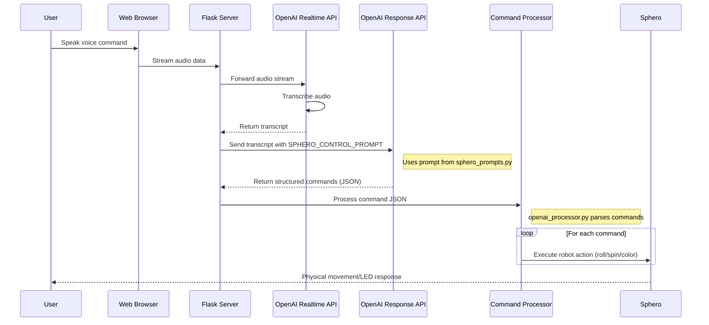

# Sphero SPRK+ Controller for macOS

A Python implementation for controlling Sphero SPRK+ and other Sphero model robots via Bluetooth Low Energy (BLE) on macOS.

## Features

- Scan for and connect to Sphero devices
- Control LED colors
- Send roll commands (direction and speed)
- Spin the Sphero in place
- Web-based control interface with Flask and Socket.IO
- Virtual joystick for intuitive direction and speed control
- Real-time feedback and status updates
- Random movement mode
- OpenAI Realtime voice integration

## Requirements

- macOS with Bluetooth 4.0+ support
- Python 3.7+
- A Sphero robot (charged and awake)
- Flask and Flask-SocketIO (included in requirements.txt)
- OpenAI API key (for voice integration)

## Installation

1. Clone this repository:
   ```bash
   git clone <repository-url>
   cd sphero-controller
   ```

2. Create a virtual environment (recommended):
   ```bash
   python3 -m venv venv
   source venv/bin/activate
   ```

3. Install the required dependencies:
   ```bash
   pip install -r requirements.txt
   ```

4. Create a `.env` file in the root directory:
   ```
   OPENAI_API_KEY=your_api_key_here
   ```

5. Ensure Bluetooth permissions are granted:
   - Go to System Settings > Privacy & Security > Bluetooth
   - Make sure Terminal or your Python IDE has access

## Usage

### Web Interface

Start the web server:

```bash
python3 app.py
```

Then navigate to `http://localhost:4000` in your web browser.

#### Using the Web Interface

1. **Connection**:
   - Click "Scan for Sphero" to find available Sphero devices
   - Select a device from the dropdown
   - Click "Connect" to establish a connection

2. **Movement Control**:
   - Use the joystick by clicking and dragging in the direction you want to move
   - The further from the center, the faster the Sphero will move
   - Release to stop

3. **LED Color**:
   - Adjust the RGB sliders to set the color
   - Click "Set Color" to update the Sphero's LED

4. **Special Actions**:
   - Set spin degrees and duration
   - Click "Spin" to make the Sphero rotate in place
   - Enable random movement mode
   - Interact with the Sphero using voice commands (requires OpenAI API key)

### CLI Interface

For a simple command-line interface:

```bash
python3 sphero_v2_control.py
```

### Available CLI Commands

- `color <r> <g> <b>` - Set the main LED color (values 0-255 for each component)
  - Example: `color 255 0 0` (sets the LED to red)

- `roll <heading> <speed> <duration>` - Make Sphero roll in a specific direction
  - `heading`: Direction in degrees (0-359, where 0 is forward)
  - `speed`: Speed value (0-255)
  - `duration`: Time in seconds
  - Example: `roll 0 100 2` (roll forward at speed 100 for 2 seconds)

- `spin <degrees> <duration>` - Spin the Sphero in place
  - `degrees`: Degrees to rotate (0-360)
  - `duration`: Time in seconds to complete the spin
  - Example: `spin 360 2` (spin in a full circle over 2 seconds)

- `demo` - Run a demonstration sequence with colors and movement

- `exit` - Exit the program

## Project Structure

The refactored application is organized into the following modules:

```
sphero_controller/
├── __init__.py          # Package initialization, app factory
├── config.py            # Configuration settings
├── sphero_connection.py # Sphero device connection handling
├── random_movement.py   # Random movement functionality
├── openai_integration.py # OpenAI API integration
├── socket_handlers.py   # Socket.IO event handlers
└── routes.py            # Flask routes

templates/               # HTML templates
static/                  # Static assets
app.py                   # Main entry point
```

## Voice Control Flow

The following sequence diagram illustrates how a user's voice command is processed and converted into Sphero robot movements:



## Troubleshooting

### Connection Issues
- Make sure your Sphero is charged and awake
- Double-check that Bluetooth is enabled on your macOS device
- Ensure no other application is currently connected to the Sphero
- Restart your Sphero by placing it on the charging base
- Try refreshing the page and scanning again (web interface)

### Permission Issues
- Make sure Terminal/Python has Bluetooth permissions in System Settings
- Try running the script with elevated permissions if necessary

### Web Interface Issues
- Make sure Flask and Flask-SocketIO are installed
- Check the terminal for any error messages
- Make sure you're accessing the correct URL (http://localhost:4000)

## Implementation Details

This controller uses the [spherov2](https://pypi.org/project/spherov2/) library, which is an unofficial but well-maintained Python library for communicating with Sphero robots. The library supports a wide range of Sphero models including:

- Sphero SPRK+
- Sphero Mini
- Sphero Bolt
- Sphero R2-D2
- And more

The web interface is built using:
- Flask for the web server
- Flask-SocketIO for real-time communication between the browser and server
- Bootstrap for responsive UI
- JavaScript for the joystick control and UI interactions

## License

MIT License 